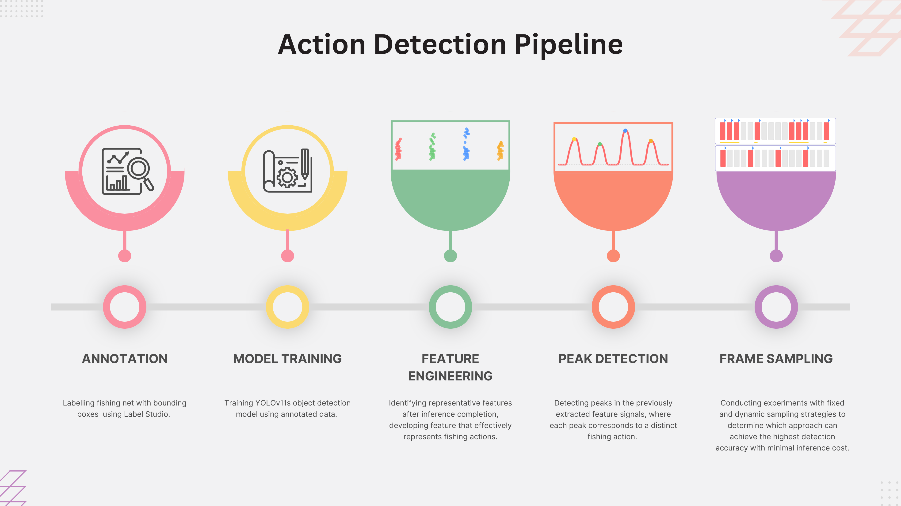
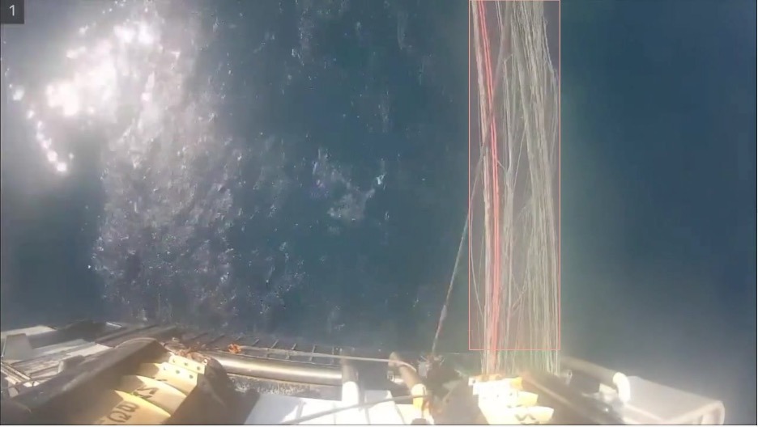
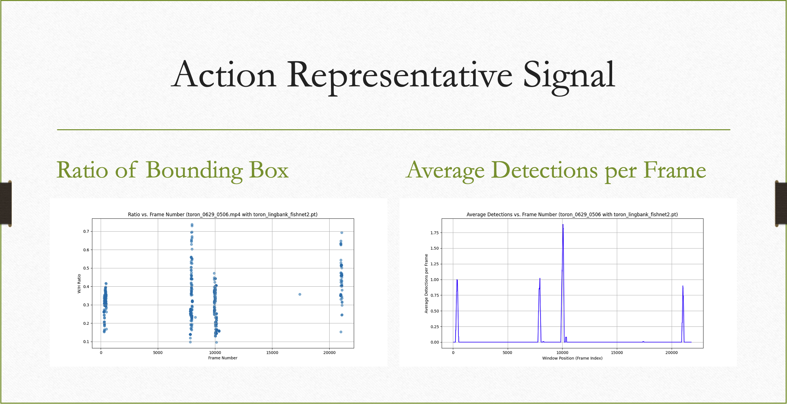
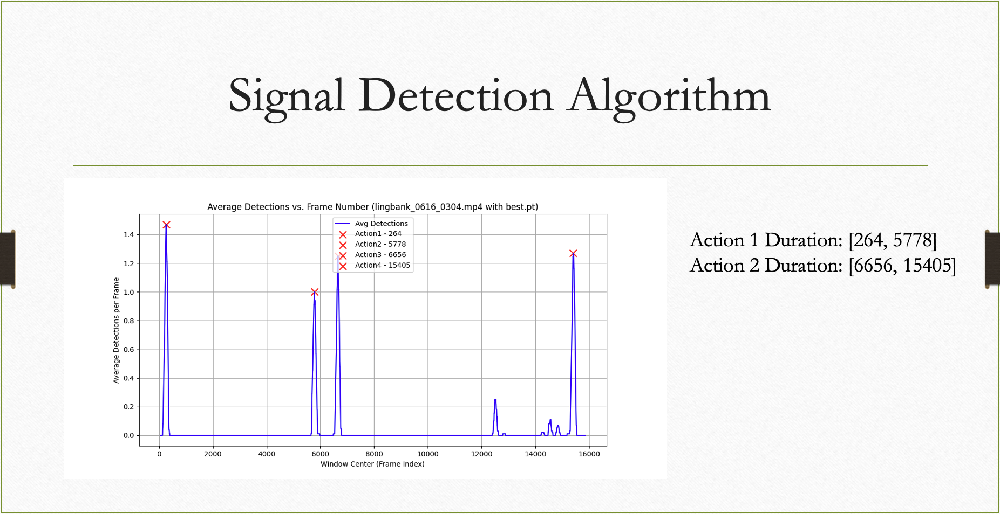
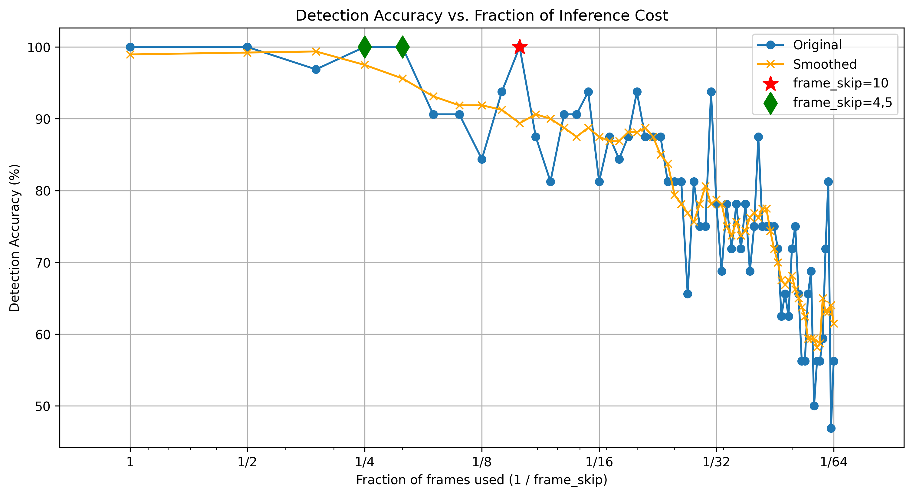
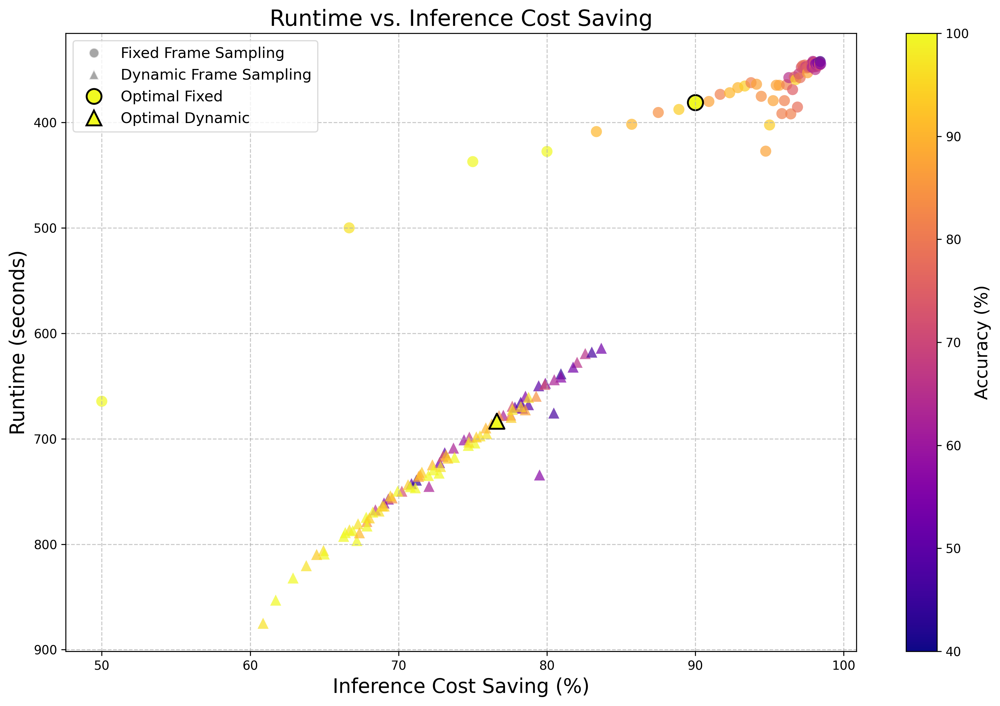

# Long Video Action Detection Pipeline

---

## 🚀 Project Goal

This project delivers a lightweight, reproducible **Detector-Analyzer** intelligent system for **long‑video action detection**—identifying events in hours‑long fishing footage.  
The demo walks through the full flow:

1. Batched, asynchronous frame loading  
2. YOLO‑based inference on MPS or CUDA  
3. Aggregating detections into an **action‑representative signal**  
4. Executing custom post‑detection algorithms (peak or interval detection)  
5. Plotting & exporting results for quick inspection 




---

## 🔧 Prerequisites

| Item            | Requirement     |
|-----------------|-----------------|
| **OS**          | macOS or Ubuntu |
| **Environment** | Miniconda       |

---

## 📚 Required Scripts

- `fixed_experiments.py` — main entry point for single‑action demo  
- `config.py` — global paths & environment settings  
- `experiment_config.py` — action‑specific hyper‑parameters  
- `common_experiments.py` — shared experiment helpers  
- `batch_utils.py` — batch‑construction utilities  
- `detection_utils.py` — post‑processing & metric computation  
- `video_batch_processor_unified.py` — unified batch inference engine  
- `video_processor_async.py` — asynchronous frame loader  
- `action_detection.py` — low‑level detection wrapper  

**Included folders**

```
model_weights/           # Pretrained weights (e.g., pumping.pt)
selected_test_video/     # Demo clips grouped by action type
plot/                    # Output directory for detection plots
```

---

## 🛠️ Setup

Run the one‑click script at the repository root:

```bash
bash install_dependencies.sh
```

The script will:

1. **Create** (or reuse) a Conda environment named **`haul_env`** with Python 3.12  
2. **Detect** your OS (macOS MPS vs. Ubuntu CPU/GPU) and install the correct PyTorch build  
3. **Install** all remaining packages from **`requirements.txt`**

If you prefer a manual install, open the script and execute the commands step‑by‑step.

---

## ⚡️ Run a Pumping Detection Demo

```bash
python fixed_experiments.py \
  --single \
  --action_type pumping \
  --frame_skip 4 \
  --video_root selected_test_video \
  --model_weight model_weights/pumping.pt
```

This command will:

1. **Load** frames asynchronously in batches  
2. **Infer** detections with YOLO  
3. **Compute** an action‑representative signal (detections / frame)  
4. **Apply** post‑detection algorithms (peak or interval detection)  
5. **Save** plots & CSV to `plot/latest/`  
6. **Done!** Review results in the output folder  

After the run, open **`plot/latest/`** to view detection timelines, signals, and summary CSV.

---

## 🧪 R&D Process & Key Experiments

1. **Visual primitives & raw detections**  
   Accurately recognising a high-level action in a long video first requires detecting the *visual primitives* that uniquely characterise that action — for example, a **fish-net**, deck personnel, or the fish themselves.  
   *Illustration* ↓

   

2. **Formulating an action-representative signal**  
   Our signal design was guided by two principles:  
   1. **Computational thrift** — it must be derivable directly from raw detections with negligible overhead.  
   2. **Human interpretability** — when model accuracy is acceptable, the signal shape should allow a human to infer the action visually.  
   We compared two candidate formulations (see figure) and ultimately adopted **average detections per frame**, offering a robust compromise between noise suppression and temporal fidelity.
   
   

3. **Temporal reasoning via post-detection analysis**  
   To recover the *duration* of an action such as fishing, we detect local maxima in the signal that correspond to the **net cast** and **net retrieval** events.  
   Each odd-even peak pair brackets a single action interval; peak prominence and minimum-distance thresholds are carefully tuned (see below).  
   

4. **Frame-skip versus accuracy trade-off**  
   A ten-minute clip at 30 fps contains 18 000 frames; inferring on every frame is cost-prohibitive.  
   Experiments show that a **frame-skip of 4–5** — sampling roughly 20 – 25 % of frames — still achieves **100 % recall** across 48 validation videos.  
   

5. **Dynamic frame-skip strategy (DNFS)**  
   We prototyped a dynamic scheme that predicts imminent object absence and skips accordingly, with a short rewind on positive detections.  
   Despite its conceptual elegance, DNFS introduces additional latency and GPU load because both predictor and detector must co-reside on the device — making it unsuitable for edge deployment where resources are limited.

   

6. **Deployment readiness**  
   With the detector, temporal logic, and frame-sampling policy validated, we quantised the model to **INT8** and benchmarked it on representative edge hardware, laying the groundwork for production deployment.

## 💡 Technical Highlights

- **High‑throughput frame loader** — `video_processor_async.py` uses *asyncio* + prefetch queues to maximise GPU utilisation.  
- **Unified batch inference** — `video_batch_processor_unified.py` auto‑adjusts batch size for your GPU.  
- **Action signal & post‑detection** — per‑frame counts feed peak/interval detectors to pinpoint events.  
- **False‑positive reduction** — action‑specific thresholds and signal smoothing eliminate spurious detections.  
- **Modular configuration** — tweak everything in `config.py` & `experiment_config.py`.  

---
